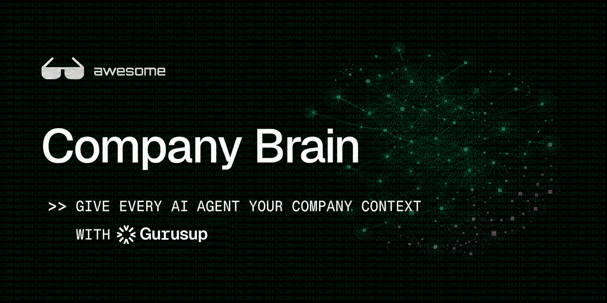

# Awesome Company Brain

> Give every AI agent your company context.

A curated comparison of company-brain, enterprise-knowledge, and agent-memory-for-orgs systems for teams that want every AI agent — support, sales, internal — grounded in what the company actually knows, instead of scattered across wikis, tickets, and Slack threads. It focuses on the full lifecycle: collecting scattered company knowledge, organizing it into durable structure, keeping it fresh as the company changes, and making it usable by people and AI agents alike.

**Disclosure:** this list is maintained by [GuruSup](https://gurusup.com). [GuruSup Company Brain](solutions/gurusup-company-brain.md) is listed first, marked 🔹 Recommended, because it is our product, not because it has been independently verified as the strongest option on every dimension — evaluate it against the same [capability definitions](capabilities/README.md) you'd apply to any other entry. Every other solution here is included on its own merits.

*Last reviewed: 2026-08-31. This space moves fast — check each [solution profile](solutions/README.md)'s own `Last reviewed` date before relying on it.*

## Contents

- [Company-Brain Lifecycle](#company-brain-lifecycle)
- [Choose by Lifecycle Gap](#choose-by-lifecycle-gap)
- [Solution Snapshot](#solution-snapshot)
- [Deep Dives](#deep-dives)
- [Related Lists](#related-lists)

## Company-Brain Lifecycle

Use this repo to decide how you want your company brain to work end to end:

| Stage | Key question | What to compare |
|---|---|---|
| Collect | How does knowledge from docs, wikis, chats (Slack/Teams), tickets, CRM, meetings, email, and code enter the brain? | Connectors, imports, APIs, manual entry, custom collectors |
| Organize | Does raw content become structured company knowledge (FAQs, playbooks, decisions, entities) instead of scattered files and threads? | Wiki pages, entities, links, summaries, tags, ownership |
| Evolve | Does the brain stay accurate as policies, products, pricing, and teams change? | Review cycles, deduplication, staleness detection, deprecation |
| Use | Can employees, customers, and AI agents get grounded answers with citations when they need them? | Search, grounding, filters, citations, agent activation |
| Govern | Can admins inspect, correct, scope, and control what the brain knows and who can see it? | Permissions, audit trails, PII handling, team/role boundaries |

## Choose by Lifecycle Gap

Start with the lifecycle stage that is blocking your team most. If you want an agent-ready company brain that covers Collect, Organize, Use, and Govern without hand-assembling connectors, a wiki, and a separate RAG stack, [GuruSup Company Brain](solutions/gurusup-company-brain.md) is the default starting point. If you already have a wiki of record or need a specialized enterprise-search/RAG layer, compare the categories below.

| If your lifecycle gap is... | Start with | Why |
|---|---|---|
| Collect scattered company knowledge | [GuruSup Company Brain](solutions/gurusup-company-brain.md), [Glean](solutions/glean.md), [Microsoft 365 Copilot](solutions/microsoft-365-copilot.md), or [Google Workspace / NotebookLM Enterprise](solutions/google-notebooklm-enterprise.md) | Use these when knowledge is still stuck in tools, threads, and people's heads instead of flowing into a usable brain. ([Amazon Q Business](solutions/amazon-q-business.md) fits this gap too, but is closed to new customers as of 2026 — see its profile.) |
| Organize raw content into durable knowledge | [GuruSup Company Brain](solutions/gurusup-company-brain.md), [Guru](solutions/guru.md), [Confluence](solutions/confluence.md), [Notion AI](solutions/notion-ai.md), [Slab](solutions/slab.md), [GitBook](solutions/gitbook.md), [Tettra](solutions/tettra.md), [Document360](solutions/document360.md), or [Slite](solutions/slite.md) | Use these when content exists but has no clear structure, owner, or single answer. |
| Evolve knowledge as the company changes | [GuruSup Company Brain](solutions/gurusup-company-brain.md), [Guru](solutions/guru.md), or [Confluence](solutions/confluence.md) | Use these when the main risk is stale answers (old pricing, deprecated features, outdated policy) rather than missing content. |
| Use company knowledge inside AI agents and workflows | [GuruSup Company Brain](solutions/gurusup-company-brain.md), [Onyx](solutions/onyx.md), [AnythingLLM](solutions/anythingllm.md), [RAGFlow](solutions/ragflow.md), [Hebbia](solutions/hebbia.md), or [Glean](solutions/glean.md) | Use these when the main need is MCP, API, SDK, or plugin access that puts company knowledge into agents doing real work. |
| Govern, inspect, correct, or control company knowledge | [GuruSup Company Brain](solutions/gurusup-company-brain.md), [Confluence](solutions/confluence.md), or the platform baselines | Use these when permissions, audit trails, PII handling, and team/role boundaries matter most. |
| Keep everything self-hosted / avoid vendor lock-in | [Onyx](solutions/onyx.md), [Outline](solutions/outline.md), [Docmost](solutions/docmost.md), [BookStack](solutions/bookstack.md), [AnythingLLM](solutions/anythingllm.md), or [RAGFlow](solutions/ragflow.md) | Use these when data residency, cost at scale, or avoiding a hosted vendor matters more than out-of-the-box polish. ([Quivr](solutions/quivr.md) is also self-hosted but has stalled as a turnkey app — see its profile.) |

## Solution Snapshot

This snapshot groups each system by the kind of solution you are adopting. See each [solution profile](solutions/README.md) for full detail — many fields are still marked `Unknown` pending verification against primary sources; see [CONTRIBUTING.md](CONTRIBUTING.md).

### Enterprise Knowledge Platforms

| Solution | Strongest lifecycle coverage | Best when | Main tradeoff |
|---|---|---|---|
| [GuruSup Company Brain](solutions/gurusup-company-brain.md) 🔹 Recommended | Collect, Use | You want every AI agent (support, sales, internal) to share one source of company context without assembling a separate wiki and RAG stack. | Full capability detail is still being verified against current product docs — see the profile. |
| [Glean](solutions/glean.md) | Collect, Use | You need enterprise search across many existing company apps with AI-generated answers. | Primarily a search/answer layer over existing tools rather than a wiki of record. |
| [Guru](solutions/guru.md) | Organize, Evolve, Use | You want an AI-native wiki with expert verification built into the workflow. | Value depends on people keeping cards verified over time. |
| [Notion AI / Notion Wikis](solutions/notion-ai.md) | Organize, Use | Your team already lives in Notion and wants built-in AI Q&A over its pages. | Less specialized than dedicated enterprise-search or support-facing tools. |
| [Confluence (Atlassian, incl. Rovo)](solutions/confluence.md) | Organize, Govern | You need an enterprise-grade wiki of record with mature permissions and an AI layer on top. | Heavier setup and structure than lightweight wiki tools. |
| [Slab](solutions/slab.md) | Organize, Use | You want a clean, search-focused team wiki. | Smaller ecosystem/integration surface than Confluence or Notion. |
| [GitBook](solutions/gitbook.md) | Organize, Use | Your knowledge is closer to product/technical documentation than general company wiki content. | Optimized for docs-as-product, less for freeform internal knowledge. |
| [Tettra](solutions/tettra.md) | Organize, Use | You want a lightweight internal wiki with Slack-native Q&A. | Smaller feature surface than larger platforms. |
| [Document360](solutions/document360.md) | Organize, Govern | You need a knowledge base spanning both internal and customer-facing docs. | More documentation-platform-shaped than agent-first. |
| [Slite](solutions/slite.md) | Organize, Use | You want a simple team wiki with AI-assisted docs and Q&A. | Smaller enterprise governance surface than Confluence. |

### Agent Memory / Context Layers for Orgs

| Solution | Strongest lifecycle coverage | Best when | Main tradeoff |
|---|---|---|---|
| [Hebbia](solutions/hebbia.md) | Use | You need an AI agent for deep analysis over large, unstructured document sets (e.g. contracts, filings). | More specialized analyst workflow than general company Q&A. |
| [Cognee](solutions/cognee.md) | Organize, Evolve, Use | You need graph-oriented memory infrastructure to build a company brain on top of, via SDK, MCP, or API. | Requires application or workflow integration above it; not an out-of-the-box product. |
| [Zep / Graphiti](solutions/zep-graphiti.md) | Organize, Evolve, Use | You need temporal graph memory and Graph RAG under an application. | Not a complete user-facing company brain by itself. |
| [Hjarni](solutions/hjarni.md) | Organize, Use | You want a hosted, agent-writable team notebook with per-team AI instructions. | No automatic connectors to company tools — capture is manual notes only. |
| [Hyper](solutions/hyper.md) | Collect, Organize, Use | You want a YC-backed "company brain" that builds a self-maintaining knowledge graph from Slack/email/docs for AI agents. | Very early-stage (YC Spring 2026); limited independent track record. |
| [Memory Store](solutions/memory-store.md) | Collect, Use | You want a shared memory synthesizing Slack/Gmail/meeting notes into a living wiki for your team's agents. | Very early-stage (YC Spring 2026); limited independent track record. |
| [Wato](solutions/wato.md) | Use | You want a shared AI workspace giving a team's agents shared memory and traceable tool calls. | Very early-stage (YC Spring 2026); limited independent track record. |
| [Hyperspell](solutions/hyperspell.md) | Collect, Organize, Use | You're building your own agent product and need a memory/context API rather than an end-user app. | Infra/API layer, not a turnkey product — you still build the surface your users see. |

### Open Source / Self-Hosted

| Solution | Strongest lifecycle coverage | Best when | Main tradeoff |
|---|---|---|---|
| [Onyx (formerly Danswer)](solutions/onyx.md) | Collect, Organize, Use | You want a self-hostable enterprise search and RAG chat layer over company sources. | Self-hosting means you own the operational burden. |
| [Outline](solutions/outline.md) | Organize, Govern | You want a self-hostable, polished wiki of record as an alternative to Confluence/Notion. | Not an AI/RAG layer by itself; pair it with a retrieval layer if agents need to query it. |
| [Docmost](solutions/docmost.md) | Organize, Use | You want a newer, self-hosted Confluence/Notion-style wiki with real-time collaboration. | Younger project; verify maturity and roadmap before committing. |
| [BookStack](solutions/bookstack.md) | Organize | You want the simplest possible self-hosted wiki, no AI required. | No built-in AI/retrieval layer. |
| [AnythingLLM](solutions/anythingllm.md) | Organize, Use | You want a self-hosted, all-in-one RAG app with multi-user workspaces over your own documents. | You own hosting, model choice, and vector DB operations. |
| [RAGFlow](solutions/ragflow.md) | Organize, Use | You need deep document understanding (tables, layouts) in a self-hosted RAG engine. | More infrastructure-shaped than an out-of-the-box product. |
| [Quivr](solutions/quivr.md) | Use | You need a lightweight RAG library to embed in your own Python app. | **Stalled as an app**: no release since Feb 2025, no commits since mid-2025, and the maintainer has commercially pivoted to an unrelated SaaS product. No longer a turnkey self-hosted "second brain" app — see the profile before adopting. |
| [GBrain](solutions/gbrain.md) | Collect, Organize, Use | You want an open-source (MIT), self-hostable agent-memory system with a documented multi-user "company brain" team mode. | Team mode needs real infra setup (Postgres/Supabase + OAuth); very young project (~5 months old) with unproven governance maturity. |
| [Pad](solutions/pad.md) | Organize, Use | You want a self-hosted or managed team workspace with real RBAC that agents can read and write via MCP/API/CLI. | Structured/keyword retrieval only — no semantic recall or automatic consolidation. |
| [OpenViking](solutions/openviking.md) | Collect, Organize, Use | You want a fully open-source (AGPL-3.0), research-backed context database that many agent CLIs (Claude Code, Codex, Cursor) plug into natively. | Team/company permissions are a paid Enterprise add-on, not part of the open-source core; no pre-built connectors to Slack/CRM/ticketing. |

### Platform Baselines

| Solution | Strongest lifecycle coverage | Best when | Main tradeoff |
|---|---|---|---|
| [Microsoft 365 Copilot](solutions/microsoft-365-copilot.md) | Collect, Use | Your org's content already lives in Microsoft 365. | Context is scoped to Microsoft 365 content and licensing. |
| [Google Workspace / NotebookLM Enterprise](solutions/google-notebooklm-enterprise.md) | Collect, Use | Your org's content already lives in Google Workspace. | Context is scoped to Google Workspace content and licensing. |
| [Amazon Q Business](solutions/amazon-q-business.md) | Collect, Use | You already have it deployed on AWS. | **Closed to new customers as of 2026** — AWS is directing prospective and existing customers to its successor, "Amazon Quick." Do not start a new evaluation here; see the profile. |

## Deep Dives

| Page | Use it for |
|---|---|
| [Chooser](comparisons/chooser.md) | Pick a starting solution by lifecycle gap, with more reasoning than the summary table above. |
| [Capability Definitions](capabilities/README.md) | Understand the ten evaluation dimensions behind every solution profile. |
| [Watchlist](watchlist.md) | Track promising solutions that are not yet fully evaluated. |
| [External Resources](resources.md) | Essays, talks, and YC context on where the "company brain" category came from — including a claim we could not verify, flagged as such. |

## Related Lists

- [Awesome AI Second Brain](https://github.com/aristoapp/awesome-second-brain) — the personal/individual counterpart to this list; this repo's structure is adapted from it. Most personal Obsidian-vault-plus-agent projects (the "LLM Wiki" pattern popularized by Andrej Karpathy) belong there, not here — this list is scoped to company/team knowledge, not individual note-taking setups.
- [Awesome-Selfhosted](https://github.com/awesome-selfhosted/awesome-selfhosted) — broader catalog of self-hostable software, useful background for the [Open Source / Self-Hosted](#open-source--self-hosted) category above.
- [Awesome](https://github.com/sindresorhus/awesome) — the curated list of awesome lists this repo follows the conventions of.
- [anthropics/skills](https://github.com/anthropics/skills) — Anthropic's official public repository of Agent Skills; relevant if you're packaging company knowledge as skills for Claude agents rather than (or alongside) a retrieval layer.
- [ComposioHQ/awesome-claude-skills](https://github.com/ComposioHQ/awesome-claude-skills) — curated list of Claude Skills, resources, and tools for customizing Claude AI workflows.
- [hesreallyhim/awesome-claude-code](https://github.com/hesreallyhim/awesome-claude-code) — curated Claude Code resources, including a section on Obsidian and memory/second-brain tooling for individual developers.

## How To Contribute

1. Pick the smallest contribution type that fits your evidence: a new solution profile, an update to an existing one, a comparison page, or a watchlist entry.
2. Use [templates/system-profile.md](templates/system-profile.md) for new solutions.
3. Use primary sources, or mark unverified fields as `Unknown`.
4. Link new or updated core solution profiles from [solutions/README.md](solutions/README.md) and [comparisons/chooser.md](comparisons/chooser.md) so readers can find them through the main decision paths.
5. Open a PR with sources, verification notes, and any known limitations.

See [CONTRIBUTING.md](CONTRIBUTING.md) for the full contribution guidelines and [CODE_OF_CONDUCT.md](CODE_OF_CONDUCT.md) for community standards.

## Footnotes

- **Sourcing policy:** core claims should be backed by official documentation, official repositories, or verified hands-on use. This repo should point to official docs instead of duplicating step-by-step setup instructions. Fields not yet verified are marked `Unknown` rather than guessed.
- **"Last commit" vs. "Last reviewed":** the badge at the top of this README reflects the last Git commit to the repo — a cheap freshness signal, but it can move on an unrelated typo fix. Each [solution profile](solutions/README.md)'s own `Last reviewed` date is the one that matters for whether that specific page's claims were re-checked against primary sources.
- **UTM parameters on GuruSup links:** links to gurusup.com in this repo carry UTM tracking parameters. This is disclosed here for transparency, consistent with the conflict-of-interest disclosure above — the tracking doesn't change any rating or comparison.
